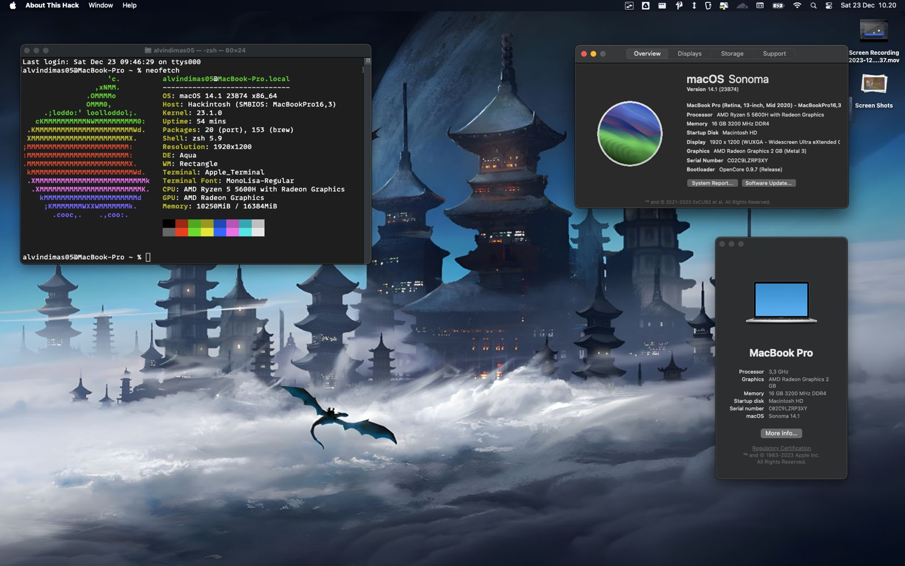

# EFI Hackintosh Laptop ASUS Vivobook 16x M1603QA

## 💻 Specs :

- <b>Processor</b>: AMD Ryzen 5 5600H  
- <b>iGPU</b>: AMD Radeon RX Vega 7  
- <b>Storage</b>: SSD INTEL 512GB 670P M.2 SSDPEKNU512GZX1 PCIe 3.0 x4 NVMe 
- <b>Ram</b>:  8GB DDR4 on board + 8GB DDR4 SO-DIMM
- <b>Wireless & Bluetooth</b> : ~~Mediatek MT7921~~ Intel AX200 (Replaced)
- <b>Audio Codec</b>: ALC256
- <b>MacOs Version</b>: Sonoma 14.1
- <b>Installer</b>: Olarilla

## ⚙️ BIOS
### Default
- <b>SATA Mode</b>: AHCI
### UMAF
- <b>VRAM</b>: 2 GB [Change VRAM Guide](https://www.youtube.com/watch?v=0jwrWCF5fhc) (For apps)
- <b>AMD PBS Option > s3/Modern Standby Support</b>: s3 Enable (For sleep)

## 📈 Working
- [x] USB Ports
- [x] HDMI port & audio
- [x] Internal Audio, Internal Mic, & Headphone Jack
- [x] Trackpad
- [x] Keyboard (Including Volumes & Brightness)
- [x] Wifi & Bluetooth (Intel)
- [x] Sleep & Wake (Clamshell, Menu, & Idle)
- [x] Some Apps (Firefox, VSCode, Discord, etc)
- [x] Some VMs/Emulators (Bluestack, iPhone Simulator, Docker (Minikube))
- [x] Some Games (Roblox, etc)

## 📉 Not Working
- [x] IServices (Messages & Facetime)
- [x] DRM Support (Not tested yet)
- [x] Advanced OpenGL Apps (Chrome, Brave, etc)
- [x] Hardware Acceleration Apps (FL Studio, etc)