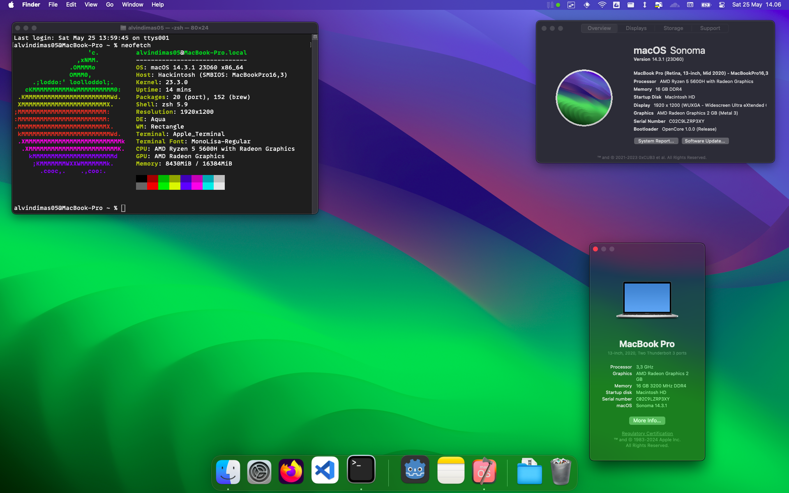

# EFI Hackintosh Laptop ASUS Vivobook 16x M1603QA



## 💻 Specs :

- <b>Processor</b>: AMD Ryzen 5 5600H  
- <b>iGPU</b>: AMD Radeon RX Vega 7  
- <b>Storage</b>: SSD INTEL 512GB 670P M.2 SSDPEKNU512GZX1 PCIe 3.0 x4 NVMe 
- <b>Ram</b>: 8GB DDR4 on board + 8GB DDR4 SO-DIMM
- <b>Wireless & Bluetooth</b>: ~~Mediatek MT7921~~ Intel AX200 (Replaced)
- <b>Audio Codec</b>: ALC256
- <b>MacOs Version</b>: Sonoma 14.3.1
- <b>Installer</b>: Olarilla

## 🔧 Important Tips
- When USB Mapping using USBToolbox, enable <b>Use Native Classes</b> in the <b>Settings</b> to avoid USB issues. Mainly stall at startup and possibly sleep.
- Set the VRAM to at least 1 GB for Apps to be able to run without any lags.
- Some Apps like Adobe Photoshop need [AMDFriend](https://github.com/NyaomiDEV/AMDFriend) or use [AMDHelper](https://github.com/alvindimas05/AMDHelper) to be able to run. See the details [here](https://chefkissinc.github.io/guides/hackintosh/compatibility/).
- For iServices to work, use stable version of [itlwm](https://github.com/OpenIntelWireless/itlwm/releases/latest) and [Heliport](https://github.com/OpenIntelWireless/HeliPort/releases/latest) instead of Airportitlwm.
- Sometimes the audio suddenly gone when I use audio from audio jack. The solution is to open settings and stay on Mic Input, then change into Line In.
- Docker Minikube or Nox Android Emulator works because using they using VirtualBox as driver. Use latest [VirtualBox 6](https://www.virtualbox.org/wiki/Download_Old_Builds_6_1) to make it work.

## 🔋  Optimization Tips
- Use [OC Little Daliensky](https://github.com/daliansky/OC-little/tree/master/01-%E5%85%B3%E4%BA%8EAOAC/01-5-%E7%9D%A1%E7%9C%A0%E8%87%AA%E5%8A%A8%E5%85%B3%E9%97%AD%E8%93%9D%E7%89%99WIFI) app to disable internet on sleep
- Disable [Smokeless UMAF](https://github.com/DavidS95/Smokeless_UMAF) Core Performance Boost.
- Use [RyzenAdj](https://github.com/FlyGoat/RyzenAdj) for tuning optimization.

### RyzenAdj
The optimization may be different on other cpus. Use <b>debug=0x144</b> on boot-args and run as sudo. You might need to run ```xattr -c ryzenadj```.
#### Standard RyzenAdj Optimization
```
sudo ryzenadj --stapm-limit=35000 --fast-limit=35000 --slow-limit=35000 --tctl-temp=85
```

#### Maximize RyzenAdj Optimization
```
sudo ryzenadj --stapm-limit=30000 --fast-limit=30000 --slow-limit=30000 --tctl-temp=80 --power-saving
```

## ⚙️ BIOS
### Default
- <b>SATA Mode</b>: AHCI
### [Smokeless UMAF](https://github.com/DavidS95/Smokeless_UMAF)
- <b>AMD CBS > NBIO Common Options > GFX Configuration > iGPU Configuration</b>: UMA_SPECIFIED (So that the VRAM can be changed)
- <b>AMD CBS > NBIO Common Options > GFX Configuration > UMA Frame buffer Size</b>: 2G (2G Recommended, 1G Minimum)
- <b>AMD CBS > CPU Common Options > Core Performance Boost</b>: <b>Disable</b> (Reduce Heat and Power Usage) or <b>Enable</b> (Gaming Performance)
- <b>AMD PBS > s3/Modern Standby Support</b>: s3 Enable (For sleep to work)

## 📈 Working
- [x] USB Ports
- [x] HDMI port & audio
- [x] Internal Audio, Internal Mic, & Headphone Jack
- [x] Trackpad
- [x] Keyboard (Backlight, Volumes & Brightness Control)
- [x] Wifi & Bluetooth (Intel)
- [x] Sleep & Wake (Clamshell, Menu, & Idle)
- [x] Hibernation (Yes, works with <b>hibernatemode 25</b>. Probably unstable)
- [x] Some Apps (Firefox, VSCode, Discord, etc)
- [x] Some VMs/Emulators (Nox, iPhone Simulator, Docker (Minikube))
- [x] Some Games (Roblox, etc)
- [x] iServices (iMessage & Facetime)
- [x] HID Key PWRB & SLPB

## 📉 Not Working / Unstable
- [ ] Advanced OpenGL Apps (Chrome, FL Studio, etc)
- [ ] Fingerprint (MacOs/Windows)
- [ ] Audio Quality (Not Recommended for Audiophile)